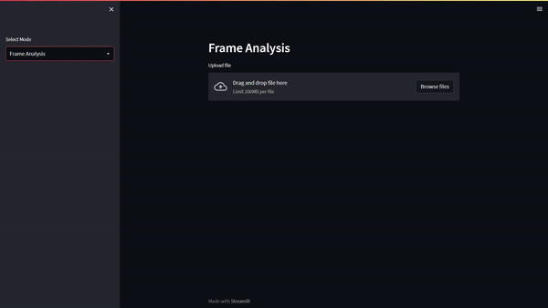

# Object Detection App
A POC app for detecting objects within a video and analysing these for estimating the price of a household insurance.
The app uses streamlit for the UI.

Uses a YOLOv6 model trained on the COCO2017 dataset for object detection.

## Installation
Create and activate virtual environment:

    python -m venv env
    source env/bin/activate

To avoid memory errors follow the commands below:

    pip install --no-cache-dir -r requirements.txt
    sudo yum install mesa-libGL -y

## Run Code
To run the streamlit code locally:

    streamlit run app.py
    
## In Depth Explaination
After uploading a video to analyse there are two modes to choose from, selectable by a streamlit sidebar.

```python
add_selectbox = st.sidebar.selectbox(
        "Select Mode",
        ("Frame Analysis", "Video Analysis")
    )
```

### Upload A Video
Upload any video for insurance analysis.



### Frame Analysis
The frame analysis makes it possible to view all detections of any frame selected with a slidebar.

### Video Analysis
The video analysis detects all objects in the video and filters out similar ones.
After that the user is prompted to input all detected objects that should be included in the household insurance.
Finally the price for the household insurance is calculated based on estimated prices for the chosen objects.

